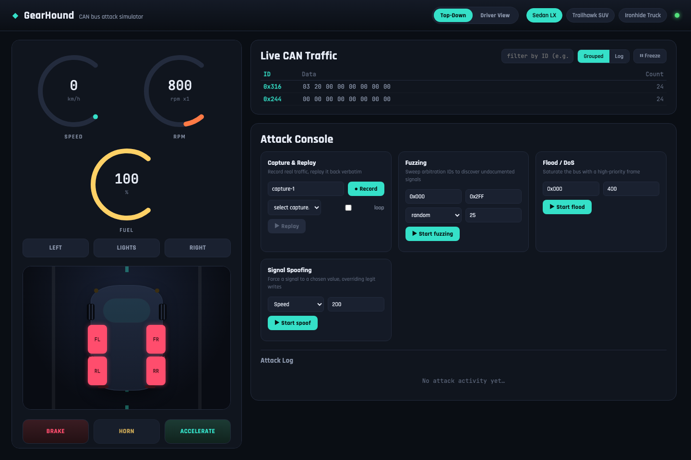
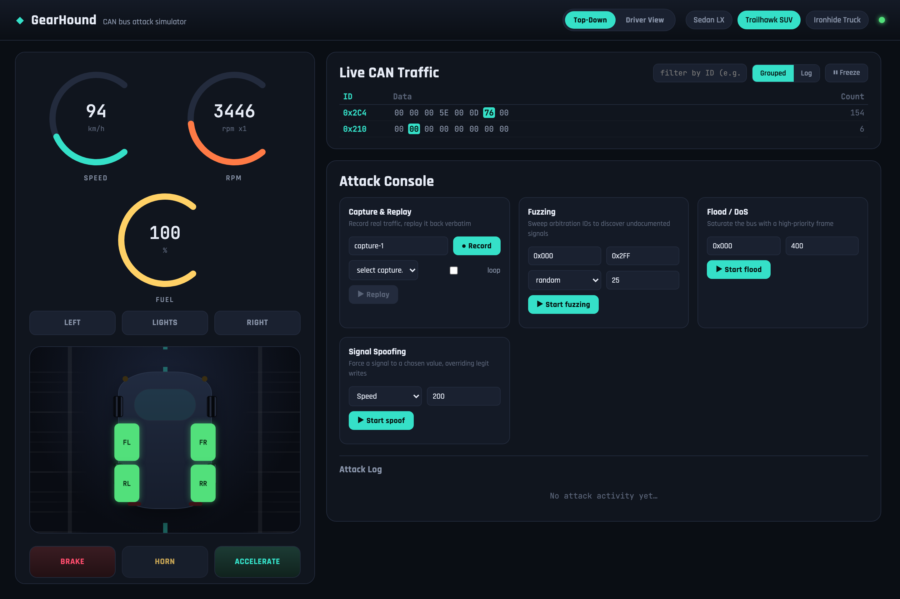
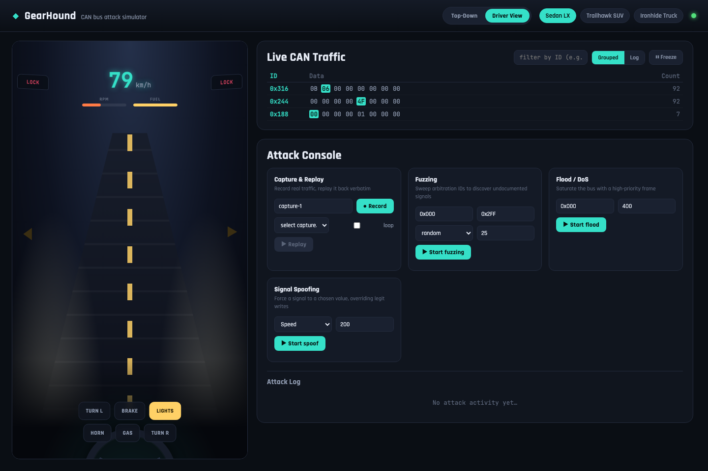
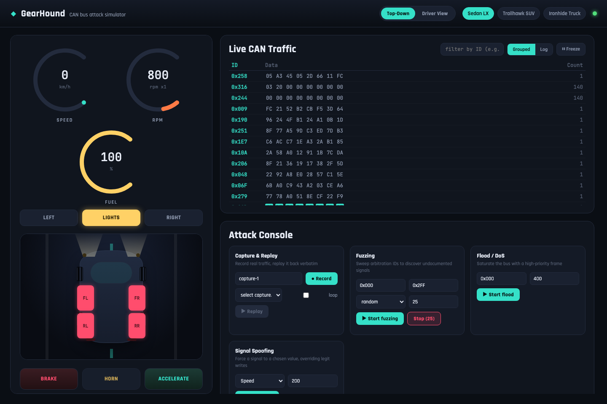

<p align="center">
  
</p>

<h1 align="center">🐺 GearHound</h1>

<p align="center">
  <strong>Hunt the signals. Decode the bus. Take the wheel.</strong><br />
  An interactive CAN bus car-hacking simulator with a live dashboard and a built-in attack console.
</p>

<p align="center">
  <a href="LICENSE"></a>
  
  
  
</p>

<p align="center">
  <a href="#-the-lab">Overview</a> ·
  <a href="#-demo">Demo</a> ·
  <a href="#-features">Features</a> ·
  <a href="#-quick-start">Quick Start</a> ·
  <a href="#-two-ways-to-drive">Two Views</a> ·
  <a href="#-attack-console">Attack Console</a> ·
  <a href="#-real-world-parallels">Real-World Parallels</a> ·
  <a href="#-vehicle-profiles">Vehicles</a> ·
  <a href="#-configuration">Configuration</a>
</p>

---

## 🎥 Demo

<p align="center">
  
</p>

<p align="center"><em>Headlights, door locks, accelerating and braking with turn signals, switching vehicle profiles, driving in both the top-down and Driver View, and a live fuzzing attack while the CAN traffic monitor updates in real time.</em></p>

---

## 🧬 The Lab

**GearHound puts automotive security experiments on your screen.** Drive a simulated vehicle, inspect live CAN traffic, and watch how injected frames affect the dashboard, all from one interface.

GearHound brings together a live dashboard, three switchable vehicle profiles, and UI-driven fuzzing, flooding, spoofing, and capture/replay.

The default **virtual CAN mode** runs entirely in Python on Linux, macOS, and Windows. For a Linux CAN lab, switch to **SocketCAN** and connect to an existing interface such as `vcan0`.

<p align="center"><strong>🚗 3 Vehicle Profiles &nbsp; • &nbsp; ⚡ 4 Attack Modes &nbsp; • &nbsp; 📡 Live CAN Traffic &nbsp; • &nbsp; 🧪 No Hardware Required in Virtual Mode</strong></p>

## ✨ Features

**Driving experience**
- Two driving views, a top-down dashboard and a first-person Driver View, switchable at any time, sharing the exact same controls and backend signals.
- A genuinely animated car, not a static status display: wheels spin faster as speed climbs, a lane line scrolls beneath the car, turn-signal lamps blink in sync with the real signal state, headlight beams switch on and off, brake lights glow under braking, and speed-line streaks appear at high speed.
- A Driver View cockpit: a perspective road receding to a vanishing point, a live HUD (speed, an RPM bar that redlines, fuel), headlight cones on the road at night, a red brake vignette, a horn ripple, door-lock status shown as side mirrors, and a steering wheel silhouette.

**Attack console**
- Fuzzing: sweep a range of arbitration IDs with random or incremental payloads to discover undocumented signals.
- Flood / DoS: saturate the bus with a high-priority frame, with modeled bus congestion that visibly drops legitimate signal updates while it runs.
- Signal spoofing: continuously force a chosen signal to a value at a configurable rate, an ongoing override, not a one-shot injection.
- Capture and replay: record real bus traffic and play it back verbatim, at adjustable speed, optionally looped.
- A live traffic monitor showing arbitration IDs, payload bytes, and per-ID change counts as frames arrive, plus a scrolling raw log view.

**Vehicle simulation**
- Three switchable vehicle profiles (Sedan LX, Trailhawk SUV, Ironhide Truck), each with a different arbitration ID map. The SUV even packs two signals into the same frame at different byte offsets.
- One unified backend process that writes legitimate signals, runs every attack, and decodes whatever is on the bus, closer to how a real ECU behaves than a split controller/simulator design.
- Two CAN backends: an in-process virtual bus that needs no OS-level CAN support (works on macOS, Windows, and Linux), or SocketCAN for a real Linux `vcan0` interface.

**Reliability**
- Refresh-safe: closing or reloading the tab mid-drive resets vehicle input instead of leaving the car accelerating forever with nobody in control.
- Reconnecting restores full state: vehicle state, vehicle list, running attacks, and saved captures, so a refreshed browser always shows the live, authoritative state.
- Finished attacks clean up after themselves instead of leaving phantom "Stop" buttons or leaking memory over a long session.

## ⚙️ Under the Hood

| Capability | What you get |
| :--- | :--- |
| 🏎️ **Live, animated dashboard** | Spinning wheels, a scrolling road, blinking indicators, headlight beams, and brake-light glow, all driven directly by real CAN state, not canned animation. |
| 🚘 **Two driving views** | A top-down dashboard and a first-person **Driver View** with a perspective road, HUD, and steering wheel. Switch anytime. |
| 🎮 **Interactive controls** | Accelerate, brake, steer the turn signals, and operate vehicle controls. |
| 📡 **Traffic monitor** | Watch arbitration IDs, payload bytes, and timestamps as frames arrive. |
| 🧨 **Built-in attack console** | Launch and stop fuzzing, flooding, spoofing, and replay from the UI. |
| 🔀 **Switchable vehicle profiles** | Explore different CAN ID maps and signals packed at different byte offsets. |
| 🧠 **Unified backend** | One process generates legitimate signals, runs attacks, and decodes bus traffic. |
| 💻 **Two CAN backends** | Use an in-process virtual bus or a Linux SocketCAN interface. |
| 🔌 **Refresh-safe** | Closing or reloading the tab mid-drive resets vehicle input instead of leaving the car accelerating forever with nobody in control. |

## 🚀 Quick Start

### Prerequisites

- **Python 3.10+**: the existing project README reports testing with Python 3.12.
- **Node.js 18+** and npm.
- **Git** to clone the repository.

### 1. Clone the lab

```bash
git clone https://github.com/LiteshGhute/GearHound.git
cd GearHound
```

### 2. Start the backend

**Linux / macOS**: from the repository root:

```bash
cd backend
python3 -m venv venv
./venv/bin/python -m pip install -r requirements.txt
CAN_BUSTYPE=virtual PORT=4000 ./venv/bin/python app.py
```

<details>
<summary><strong>🪟 Windows PowerShell</strong></summary>

From the repository root:

```powershell
cd backend
py -3 -m venv venv
.\venv\Scripts\python.exe -m pip install -r requirements.txt
$env:CAN_BUSTYPE = "virtual"
$env:PORT = "4000"
.\venv\Scripts\python.exe app.py
```

</details>

### 3. Start the frontend

Open a **second terminal** at the repository root:

```bash
cd frontend
npm install
npm run dev
```

### 4. Enter the cockpit

Open **[http://localhost:5173](http://localhost:5173)** in your browser. The backend listens on port **4000** by default.

### Or skip all of that: Docker

```bash
git clone https://github.com/LiteshGhute/GearHound.git
cd GearHound
docker compose up --build
```

Open **[http://localhost:5173](http://localhost:5173)**. Two containers: the backend
(`CAN_BUSTYPE=virtual`, no host CAN interface needed) on port `4000`, and the
frontend built and served through nginx on port `5173`. Both defined in
[`docker-compose.yml`](docker-compose.yml); the [`backend/`](backend/Dockerfile) and
[`frontend/`](frontend/Dockerfile) Dockerfiles can also be built standalone.

Vite inlines `VITE_BACKEND_URL` into the built JS at build time, not at
container start, so if the backend won't be reachable at `localhost:4000` from
wherever the browser runs (a remote host, a different port mapping), rebuild
the frontend with that URL instead:

```bash
docker compose build --build-arg VITE_BACKEND_URL=http://your-host:4000 frontend
```

To point the backend at a real Linux `vcan0` interface instead of the
built-in virtual bus, run its container with `socketcan` and host networking
(the container needs to see the host's network interfaces directly, the way
GearGoat's original container did):

```bash
docker build -t gearhound-backend ./backend
docker run --network=host --privileged \
  -e CAN_BUSTYPE=socketcan -e CAN_CHANNEL=vcan0 \
  gearhound-backend
```

## 🖥️ Two Ways to Drive

**Top-Down** is the classic bird's-eye dashboard: gauges up top, the car in the middle, pedals below. The car itself is animated, its wheels spin faster as speed climbs, indicator lamps blink in sync with the real turn signal, headlight beams and brake lights switch on and off, and a scrolling lane line behind it sells the sense of motion.

<p align="center">
  
  
</p>

**Driver View** puts you in the seat: a perspective road stretches out ahead with a scrolling centerline, headlight cones spill onto the road at night, braking pulses a red vignette at the screen edges, and a HUD shows live speed, an RPM bar that redlines, and a fuel bar. Door-lock state for the front two doors shows up as small mirrors in the corners.

<p align="center">
  
</p>

Both views, and the pedal and indicator controls beneath them, share one control hook, so pressing a button in either view produces the exact same backend signal and the exact same instant visual feedback.

## 🎮 Your First Session

1. **Pick a vehicle.** Start with Sedan LX to explore the baseline signal layout.
2. **Drive the simulation.** Use the controls and watch the dashboard respond.
3. **Switch views.** Try Driver View for the first-person cockpit, then switch back.
4. **Follow the traffic.** Compare changes in the dashboard with changing CAN payloads.
5. **Explore the attack console.** Observe how simulated vehicle state responds to injected traffic.
6. **Switch profiles.** Move to the SUV or Truck and investigate the new ID map.

## 🧨 Attack Console

| Mode | What it does | What to observe |
| :--- | :--- | :--- |
| 🎲 **Fuzzing** | Sweeps a range of arbitration IDs with random or incremental payloads. | Which frames affect signals in the active profile. |
| 🌊 **Flood / DoS** | Sends high-priority traffic while applying modeled bus congestion. | Congestion warnings and dropped legitimate updates. |
| 🎭 **Signal spoofing** | Repeatedly sends a forged signal value at a configurable rate. | An ongoing override competing with legitimate signal writes. |
| ⏺️ **Capture & replay** | Records bus traffic and replays it at adjustable speed, optionally in a loop. | Previously recorded traffic affecting the current simulation. |

**Simulation detail:** flood-induced congestion is modeled by probabilistically dropping legitimate frames. It is not a measurement of physical CAN bus saturation.

Captures are held in backend memory and are lost when the backend restarts.

<p align="center">
  
</p>

## 🌍 Real-World Parallels

None of this is invented. Every attack mode in GearHound has a documented
real-world counterpart, this is what the simulator is standing in for:

- **Signal spoofing** is exactly what Charlie Miller and Chris Valasek did
  to a Jeep Cherokee in 2015: after gaining remote access through the
  vehicle's cellular-connected infotainment unit, they pivoted onto the
  CAN bus and sent forged messages the instrument cluster and other
  modules trusted at face value, while a journalist was driving it on a
  highway. Fiat Chrysler recalled 1.4 million vehicles as a result. The
  same forged-value technique, at a much less dramatic scale, is also the
  basis of digital odometer fraud: commercial "mileage correction" tools
  plug into the OBD-II port and rewrite the values a car's modules report,
  the same trust-whatever-arrives-last weakness GearHound's spoofing card
  demonstrates live.
- **Fuzzing** an unfamiliar CAN bus to find out what an arbitration ID
  actually controls, without any documentation, is standard automotive
  security research methodology, the same approach Miller and Valasek
  used in their earlier (2013-2014) published work reverse-engineering
  Toyota and Ford vehicles message by message.
- **Flood / DoS** models the class of attack published security research
  has demonstrated against real CAN buses: exploiting the protocol's own
  error-handling rules to force a targeted ECU off the bus using nothing
  but frames injected from another node, no physical tampering required.
- **Capture and replay** is the oldest trick in CAN security, recording
  legitimate traffic and sending it back verbatim, traced back to the
  field's founding academic work, "Experimental Security Analysis of a
  Modern Automobile" (Koscher et al., IEEE Security & Privacy, 2010),
  which first showed that packet capture and replay against a real car's
  internal network could unlock doors and manipulate the dashboard.

The common thread across all four, and the one thing every fix in GearHound
keeps coming back to: a CAN bus has no built-in authentication. Nothing on
the wire asks "who sent this?", so every device connected to it has to
trust every frame that arrives. That is the single assumption every attack
here exploits, and it is the same assumption real vehicles have had to be
patched, recalled, or architecturally redesigned around.

### Step-by-step attack walkthroughs

Full solution manuals, with screenshots, live in [`manuals/`](manuals/):

- [Signal Spoofing: Faking the Speedometer](manuals/Signal-Spoofing-Attack.md), a full walkthrough of finding the speed signal's arbitration ID from live traffic, then pinning the dashboard to a fake value while the car sits still.

## 🚙 Vehicle Profiles

Different vehicles, different signal maps. Switch profiles to explore how the same kind of signal can appear under another arbitration ID or byte offset.

| Profile | Character | Speed frame | RPM frame |
| :--- | :--- | :--- | :--- |
| 🚗 **Sedan LX** | Baseline signal layout with separate speed and RPM frames. | `0x244` · bytes 3–4 | `0x316` · bytes 0–1 |
| 🚙 **Trailhawk SUV** | Different IDs, with several signals sharing frames. | `0x2C4` · bytes 2–3 | `0x2C4` · bytes 5–6 |
| 🛻 **Ironhide Truck** | Higher arbitration IDs and wider byte offsets. | `0x520` · bytes 4–5 | `0x520` · bytes 1–2 |

Byte offsets are **zero-based**. Full mappings live in [`backend/vehicles/profiles.py`](backend/vehicles/profiles.py).

## 🔧 Configuration

| Variable | Default | Purpose |
| :--- | :--- | :--- |
| `CAN_BUSTYPE` | `virtual` | CAN backend: `virtual` or `socketcan`. |
| `CAN_CHANNEL` | `gearhound` in virtual mode; `vcan0` in SocketCAN mode | Bus channel or Linux interface name. |
| `PORT` | `4000` | Backend server port. |
| `VITE_BACKEND_URL` | `http://localhost:4000` | Backend URL used by the frontend. |

To point the frontend at another backend, create `frontend/.env.local`:

```dotenv
VITE_BACKEND_URL=http://localhost:4000
```

Restart Vite after changing frontend environment variables. For a built frontend, set the URL **before** running the build.

## 🐧 Linux SocketCAN Lab

To use a Linux virtual CAN interface, create and bring up `vcan0`:

```bash
sudo modprobe vcan
sudo ip link add dev vcan0 type vcan
sudo ip link set dev vcan0 up
```

If `vcan0` already exists, skip the `ip link add` command.

Then, from `backend/`, start GearHound with:

```bash
CAN_BUSTYPE=socketcan CAN_CHANNEL=vcan0 PORT=4000 ./venv/bin/python app.py
```

The default `virtual` backend is **in-process**. Use SocketCAN when you want other local CAN tools to communicate through the same Linux interface.

## 🏗️ Frontend Build

From `frontend/`:

```bash
npm run build
```

The generated frontend is written to `frontend/dist/`. Serve that directory with a static web server and keep the backend running separately.

To preview the frontend build locally:

```bash
npm run preview
```

This builds and previews the frontend only; it does not provide a production backend deployment.

## 🔄 Reliability

- **Refreshing the page is safe.** The backend counts connected clients. If you refresh, or close a tab, while holding the accelerator or an indicator, the socket disconnect is detected and the shared physics input resets to neutral, so the car does not keep accelerating forever with nobody driving. It only resets once the last connected client is gone, so one tab closing never yanks control away from someone still actively driving in another tab.
- **Reconnecting restores full state.** On every connect, the backend re-sends the current vehicle state, vehicle list, running attacks, and saved captures, so a refreshed browser, or a second browser tab, always shows the live, authoritative state rather than a stale snapshot.
- **Attacks clean up after themselves.** A finished attack (duration elapsed, replay ended, manually stopped) is dropped from the server's running list so the console never accumulates a phantom "Stop" button, and the manager prunes its own bookkeeping so a long session with many short attacks does not leak memory.

## 🗂️ Project Map

| Path | Responsibility |
| :--- | :--- |
| [`assets/`](assets/) | Logo, screenshots, and the demo GIF used in this README. |
| [`manuals/`](manuals/) | Step-by-step attack solution manuals with screenshots. |
| [`docker-compose.yml`](docker-compose.yml) | Runs the backend and frontend together in containers. |
| [`backend/Dockerfile`](backend/Dockerfile), [`frontend/Dockerfile`](frontend/Dockerfile) | Standalone container builds for each half. |
| [`backend/app.py`](backend/app.py) | Flask-SocketIO server, vehicle physics, connection tracking, and live broadcasts. |
| [`backend/can_bus.py`](backend/can_bus.py) | Virtual CAN and SocketCAN wrapper. |
| [`backend/state.py`](backend/state.py) | Vehicle state and CAN frame decoding. |
| [`backend/vehicles/profiles.py`](backend/vehicles/profiles.py) | Vehicle profiles, signal IDs, and byte offsets. |
| [`backend/attacks/`](backend/attacks/) | Fuzzing, flooding, spoofing, replay, and attack lifecycle management. |
| [`frontend/src/components/Dashboard.jsx`](frontend/src/components/Dashboard.jsx) | Animated top-down view. |
| [`frontend/src/components/DriverView.jsx`](frontend/src/components/DriverView.jsx) | First-person cockpit view. |
| [`frontend/src/components/`](frontend/src/components/) | Gauges, traffic monitor, attack console, and vehicle selector. |
| [`frontend/src/hooks/useSocket.js`](frontend/src/hooks/useSocket.js) | Socket.IO connection and frontend state. |
| [`frontend/src/hooks/useVehicleControls.js`](frontend/src/hooks/useVehicleControls.js) | Shared pedal, indicator, and horn press handling for both views. |
| [`frontend/src/styles/global.css`](frontend/src/styles/global.css) | Dashboard styling and all animation keyframes. |

## 🛠️ Troubleshooting

<details>
<summary><strong>The dashboard cannot connect</strong></summary>

Check that the backend is running on port `4000`, or set `VITE_BACKEND_URL` to its actual URL. Restart the frontend after changing its environment configuration.

When opening the UI from another device, `localhost` refers to that device. Use the backend host's reachable address instead.

</details>

<details>
<summary><strong>Socket.IO uses polling instead of WebSocket</strong></summary>

The existing README notes that WebSocket upgrades may be unreliable with the development server. Socket.IO can fall back to HTTP long-polling, allowing the UI to keep working with potentially higher latency.

</details>

<details>
<summary><strong>SocketCAN cannot find the interface</strong></summary>

SocketCAN requires Linux and an existing interface that is up. Check that `CAN_CHANNEL` matches the interface you created. For development without a Linux CAN interface, use `CAN_BUSTYPE=virtual`.

</details>

<details>
<summary><strong>Vite reports that port 5173 is in use</strong></summary>

The project enables Vite's strict-port option. Stop the process using that port, or choose another port explicitly:

```bash
npm run dev -- --port 5174
```

</details>

<details>
<summary><strong>Docker: the UI loads but never connects to the backend</strong></summary>

`VITE_BACKEND_URL` gets baked into the frontend's JS when its image is
built, not read at container start. If the backend is not reachable at
`localhost:4000` from wherever the browser is running, rebuild the
frontend with the correct URL (see the Docker section above) rather than
just setting an environment variable on the running container, that has
no effect on an already-built image.

</details>

## 🤝 Contributing

Bug reports, clearer documentation, new vehicle profiles, and UI improvements are welcome.

1. Fork the repository and create a focused branch.
2. Make your change and verify the affected behavior.
3. For frontend changes, run `npm run build` from `frontend/`.
4. Open a pull request describing the change and how you checked it.

Found an issue? Include your operating system, Python/Node versions, CAN backend, and steps to reproduce it in an [issue](https://github.com/LiteshGhute/GearHound/issues).

## 💚 License

Released under the **[MIT License](LICENSE)**.

---

<p align="center">
  <strong>🐾 Follow the frames. Find the signal.</strong><br />
  If GearHound helps you learn, give the project a ⭐
</p>
