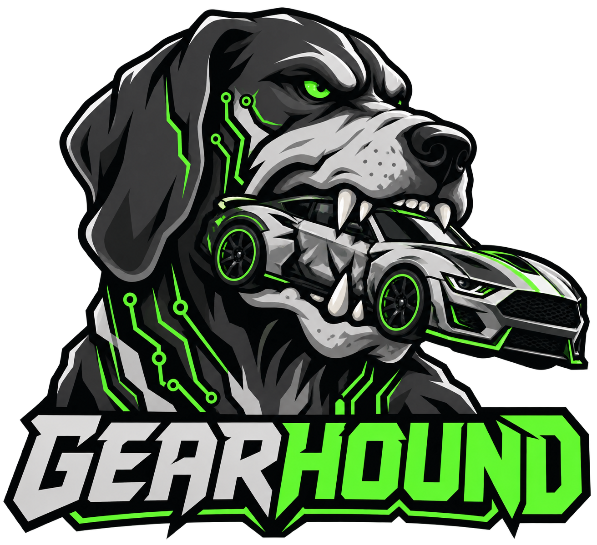

<p align="center">
  
</p>

<h1 align="center">🐺 GearHound</h1>

<p align="center">
  <strong>Hunt the signals. Decode the bus. Take the wheel.</strong><br />
  An interactive CAN bus car-hacking simulator with a live dashboard and a built-in attack console.
</p>

<p align="center">
  <a href="LICENSE"></a>
  
  
  
</p>

<p align="center">
  <a href="#-the-lab">Overview</a> ·
  <a href="#-under-the-hood">Features</a> ·
  <a href="#-quick-start">Quick Start</a> ·
  <a href="#-attack-console">Attack Console</a> ·
  <a href="#-vehicle-profiles">Vehicles</a> ·
  <a href="#-configuration">Configuration</a>
</p>

---

## 🧬 The Lab

**GearHound puts automotive security experiments on your screen.** Drive a simulated vehicle, inspect live CAN traffic, and watch how injected frames affect the dashboard, all from one interface.

GearHound brings together a live dashboard, three switchable vehicle profiles, and UI-driven fuzzing, flooding, spoofing, and capture/replay.

The default **virtual CAN mode** runs entirely in Python on Linux, macOS, and Windows. For a Linux CAN lab, switch to **SocketCAN** and connect to an existing interface such as `vcan0`.

<p align="center"><strong>🚗 3 Vehicle Profiles &nbsp; • &nbsp; ⚡ 4 Attack Modes &nbsp; • &nbsp; 📡 Live CAN Traffic &nbsp; • &nbsp; 🧪 No Hardware Required in Virtual Mode</strong></p>

## ⚙️ Under the Hood

| Capability | What you get |
| :--- | :--- |
| 🏎️ **Live vehicle dashboard** | Speed, RPM, fuel, doors, turn signals, headlights, and horn state. |
| 🎮 **Interactive controls** | Accelerate, brake, steer the turn signals, and operate vehicle controls. |
| 📡 **Traffic monitor** | Watch arbitration IDs, payload bytes, and timestamps as frames arrive. |
| 🧨 **Built-in attack console** | Launch and stop fuzzing, flooding, spoofing, and replay from the UI. |
| 🔀 **Switchable vehicle profiles** | Explore different CAN ID maps and signals packed at different byte offsets. |
| 🧠 **Unified backend** | One process generates legitimate signals, runs attacks, and decodes bus traffic. |
| 💻 **Two CAN backends** | Use an in-process virtual bus or a Linux SocketCAN interface. |
| 🌑 **Dark dashboard theme** | A focused interface for watching vehicle state and bus activity together. |

## 🚀 Quick Start

### Prerequisites

- **Python 3.10+**: the existing project README reports testing with Python 3.12.
- **Node.js 18+** and npm.
- **Git** to clone the repository.

### 1. Clone the lab

```bash
git clone https://github.com/LiteshGhute/GearHound.git
cd GearHound
```

### 2. Start the backend

**Linux / macOS**: from the repository root:

```bash
cd backend
python3 -m venv venv
./venv/bin/python -m pip install -r requirements.txt
CAN_BUSTYPE=virtual PORT=4000 ./venv/bin/python app.py
```

<details>
<summary><strong>🪟 Windows PowerShell</strong></summary>

From the repository root:

```powershell
cd backend
py -3 -m venv venv
.\venv\Scripts\python.exe -m pip install -r requirements.txt
$env:CAN_BUSTYPE = "virtual"
$env:PORT = "4000"
.\venv\Scripts\python.exe app.py
```

</details>

### 3. Start the frontend

Open a **second terminal** at the repository root:

```bash
cd frontend
npm install
npm run dev
```

### 4. Enter the cockpit

Open **[http://localhost:5173](http://localhost:5173)** in your browser. The backend listens on port **4000** by default.

## 🎮 Your First Session

1. **Pick a vehicle.** Start with Sedan LX to explore the baseline signal layout.
2. **Drive the simulation.** Use the controls and watch the dashboard respond.
3. **Follow the traffic.** Compare changes in the dashboard with changing CAN payloads.
4. **Explore the attack console.** Observe how simulated vehicle state responds to injected traffic.
5. **Switch profiles.** Move to the SUV or Truck and investigate the new ID map.

## 🧨 Attack Console

| Mode | What it does | What to observe |
| :--- | :--- | :--- |
| 🎲 **Fuzzing** | Sweeps a range of arbitration IDs with random or incremental payloads. | Which frames affect signals in the active profile. |
| 🌊 **Flood / DoS** | Sends high-priority traffic while applying modeled bus congestion. | Congestion warnings and dropped legitimate updates. |
| 🎭 **Signal spoofing** | Repeatedly sends a forged signal value at a configurable rate. | An ongoing override competing with legitimate signal writes. |
| ⏺️ **Capture & replay** | Records bus traffic and replays it at adjustable speed, optionally in a loop. | Previously recorded traffic affecting the current simulation. |

**Simulation detail:** flood-induced congestion is modeled by probabilistically dropping legitimate frames. It is not a measurement of physical CAN bus saturation.

Captures are held in backend memory and are lost when the backend restarts.

## 🚙 Vehicle Profiles

Different vehicles, different signal maps. Switch profiles to explore how the same kind of signal can appear under another arbitration ID or byte offset.

| Profile | Character | Speed frame | RPM frame |
| :--- | :--- | :--- | :--- |
| 🚗 **Sedan LX** | Baseline signal layout with separate speed and RPM frames. | `0x244` · bytes 3–4 | `0x316` · bytes 0–1 |
| 🚙 **Trailhawk SUV** | Different IDs, with several signals sharing frames. | `0x2C4` · bytes 2–3 | `0x2C4` · bytes 5–6 |
| 🛻 **Ironhide Truck** | Higher arbitration IDs and wider byte offsets. | `0x520` · bytes 4–5 | `0x520` · bytes 1–2 |

Byte offsets are **zero-based**. Full mappings live in [`backend/vehicles/profiles.py`](backend/vehicles/profiles.py).

## 🔧 Configuration

| Variable | Default | Purpose |
| :--- | :--- | :--- |
| `CAN_BUSTYPE` | `virtual` | CAN backend: `virtual` or `socketcan`. |
| `CAN_CHANNEL` | `gearhound` in virtual mode; `vcan0` in SocketCAN mode | Bus channel or Linux interface name. |
| `PORT` | `4000` | Backend server port. |
| `VITE_BACKEND_URL` | `http://localhost:4000` | Backend URL used by the frontend. |

To point the frontend at another backend, create `frontend/.env.local`:

```dotenv
VITE_BACKEND_URL=http://localhost:4000
```

Restart Vite after changing frontend environment variables. For a built frontend, set the URL **before** running the build.

## 🐧 Linux SocketCAN Lab

To use a Linux virtual CAN interface, create and bring up `vcan0`:

```bash
sudo modprobe vcan
sudo ip link add dev vcan0 type vcan
sudo ip link set dev vcan0 up
```

If `vcan0` already exists, skip the `ip link add` command.

Then, from `backend/`, start GearHound with:

```bash
CAN_BUSTYPE=socketcan CAN_CHANNEL=vcan0 PORT=4000 ./venv/bin/python app.py
```

The default `virtual` backend is **in-process**. Use SocketCAN when you want other local CAN tools to communicate through the same Linux interface.

## 🏗️ Frontend Build

From `frontend/`:

```bash
npm run build
```

The generated frontend is written to `frontend/dist/`. Serve that directory with a static web server and keep the backend running separately.

To preview the frontend build locally:

```bash
npm run preview
```

This builds and previews the frontend only; it does not provide a production backend deployment.

## 🗂️ Project Map

| Path | Responsibility |
| :--- | :--- |
| [`assets/GearHound-logo.png`](assets/GearHound-logo.png) | GearHound logo. |
| [`backend/app.py`](backend/app.py) | Flask-SocketIO server, vehicle physics, and live broadcasts. |
| [`backend/can_bus.py`](backend/can_bus.py) | Virtual CAN and SocketCAN wrapper. |
| [`backend/state.py`](backend/state.py) | Vehicle state and CAN frame decoding. |
| [`backend/vehicles/profiles.py`](backend/vehicles/profiles.py) | Vehicle profiles, signal IDs, and byte offsets. |
| [`backend/attacks/`](backend/attacks/) | Fuzzing, flooding, spoofing, replay, and attack lifecycle management. |
| [`frontend/src/components/`](frontend/src/components/) | Dashboard, gauges, traffic monitor, attack console, and vehicle selector. |
| [`frontend/src/hooks/useSocket.js`](frontend/src/hooks/useSocket.js) | Socket.IO connection and frontend state. |
| [`frontend/src/styles/global.css`](frontend/src/styles/global.css) | Dashboard styling. |

## 🛠️ Troubleshooting

<details>
<summary><strong>The dashboard cannot connect</strong></summary>

Check that the backend is running on port `4000`, or set `VITE_BACKEND_URL` to its actual URL. Restart the frontend after changing its environment configuration.

When opening the UI from another device, `localhost` refers to that device. Use the backend host's reachable address instead.

</details>

<details>
<summary><strong>Socket.IO uses polling instead of WebSocket</strong></summary>

The existing README notes that WebSocket upgrades may be unreliable with the development server. Socket.IO can fall back to HTTP long-polling, allowing the UI to keep working with potentially higher latency.

</details>

<details>
<summary><strong>SocketCAN cannot find the interface</strong></summary>

SocketCAN requires Linux and an existing interface that is up. Check that `CAN_CHANNEL` matches the interface you created. For development without a Linux CAN interface, use `CAN_BUSTYPE=virtual`.

</details>

<details>
<summary><strong>Vite reports that port 5173 is in use</strong></summary>

The project enables Vite's strict-port option. Stop the process using that port, or choose another port explicitly:

```bash
npm run dev -- --port 5174
```

</details>

## 🤝 Contributing

Bug reports, clearer documentation, new vehicle profiles, and UI improvements are welcome.

1. Fork the repository and create a focused branch.
2. Make your change and verify the affected behavior.
3. For frontend changes, run `npm run build` from `frontend/`.
4. Open a pull request describing the change and how you checked it.

Found an issue? Include your operating system, Python/Node versions, CAN backend, and steps to reproduce it in an [issue](https://github.com/LiteshGhute/GearHound/issues).

## 💚 License

Released under the **[MIT License](LICENSE)**.

---

<p align="center">
  <strong>🐾 Follow the frames. Find the signal.</strong><br />
  If GearHound helps you learn, give the project a ⭐
</p>
