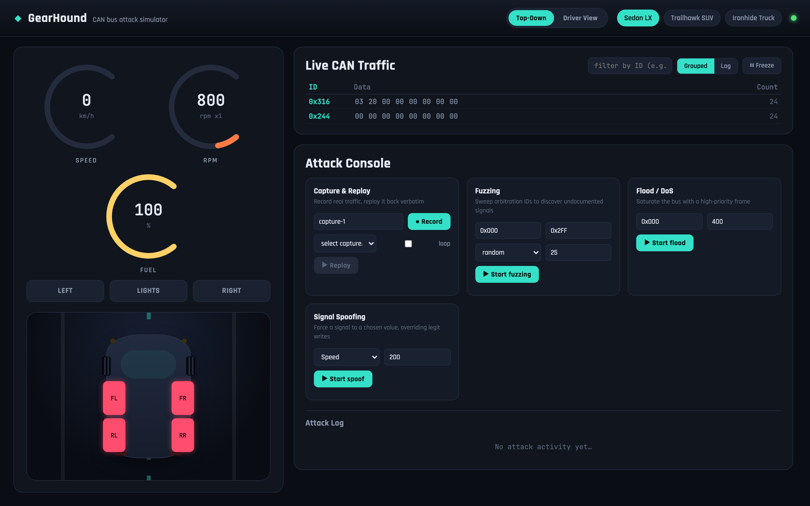
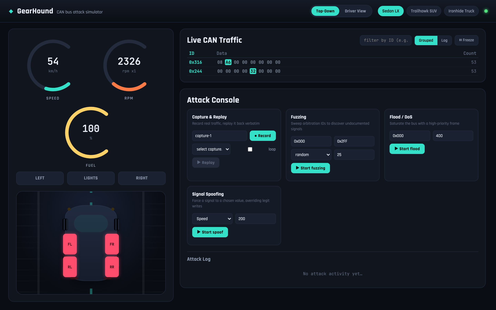
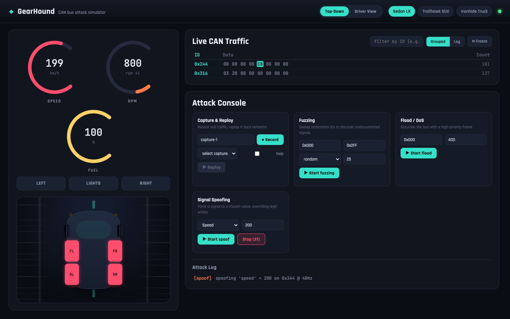
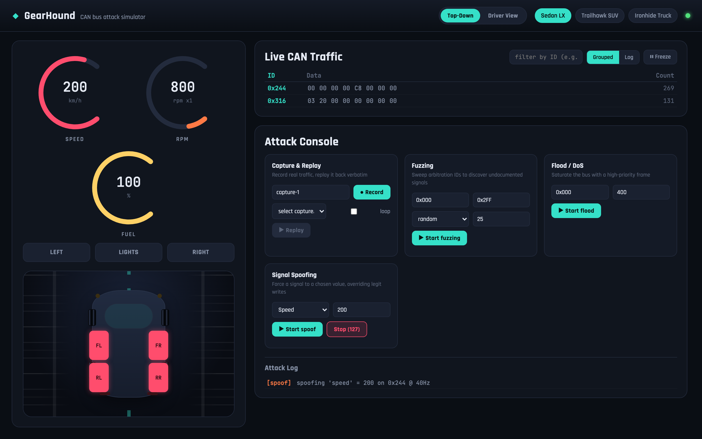
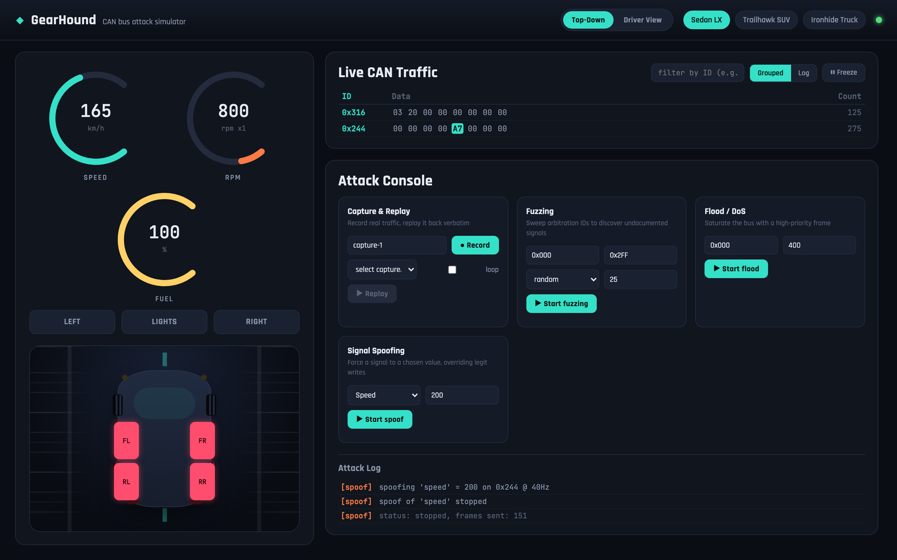

# Signal Spoofing: Faking the Speedometer

## Objectives

Use GearHound's Attack Console to continuously override the vehicle's speed
signal on the CAN bus, forcing the dashboard to display a speed the car is
not actually going, while it sits completely still. Along the way, learn how
to find which arbitration ID carries a signal you care about using the live
traffic monitor instead of reading the source.

## Background

A CAN bus has no built-in authentication. Every device wired to it, the real
instrument cluster, the engine control unit, and an attacker's device alike,
can send a frame with any arbitration ID and any payload, and every other
device on the bus will treat it as legitimate. There is nothing in the
protocol that says "only the engine module is allowed to report speed."

Signal spoofing exploits this directly: instead of a single forged frame,
the attacker sends the same forged value over and over, fast enough to win
the "last write wins" race against whatever the real sender is doing. The
result is not a glitch, it is a sustained, convincing override. On a real
vehicle this is the mechanism behind attacks like disguising a car's true
road speed from telematics or a driver display.

## Solution

**Step 1.** Open GearHound and confirm the baseline: the car is stationary
(SPEED reads 0), on the default Sedan LX profile, and the Signal Spoofing
card in the Attack Console is visible with its defaults already pointed at
the `Speed` signal.

**Step 2.** Before attacking a signal, find out which arbitration ID
actually carries it. Rather than reading `backend/vehicles/profiles.py`,
you can discover this live: hold the ACCELERATE pedal for a moment and
watch the **Live CAN Traffic** panel. One frame's bytes will visibly change
in sync with the SPEED gauge, here it is `0x244`, with the highlighted byte
climbing as speed increases. That is the signal to target.

**Step 3.** Let off the pedal and brake back down to a full stop, so the
override you are about to apply is obviously fake rather than blending in
with real acceleration. With the car back at rest, the Signal Spoofing card
is staged: `Speed`, value `200`, ready to go.

**Step 4.** Click **Start spoof**. Within about a second the SPEED gauge
snaps to 200 km/h and turns red (past the simulator's danger threshold),
while RPM stays parked at idle (800). That mismatch, a "moving" speedometer
next to an idling engine, is the tell that the reading is forged rather than
real. The Attack Console shows a `Stop` button and the Attack Log records
exactly what is happening: `spoofing 'speed' = 200 on 0x244 @ 40Hz`.

**Step 5.** This is not a one-shot glitch. Wait a few seconds and check
back: the speed is still pinned at exactly 200, and the frame counter on the
`Stop` button keeps climbing (127 frames sent and counting), confirming the
attack is continuously re-asserting the value 40 times a second.

**Step 6.** Click **Stop**. The override ends immediately, and the real
physics takes back over: speed decays on its own (no longer pinned, now
185 and falling, shown in the normal accent color again). The Attack Log
records the stop and a final tally: `spoof of 'speed' stopped`,
`status: stopped, frames sent: 151`.

## What this demonstrates

- **No authentication means no gatekeeping.** Nothing on the bus verifies
  that a `0x244` frame actually came from the real speed sender.
- **Frequency wins.** The spoof only needed to write faster than the
  legitimate source to dominate what the dashboard displays, no need to
  silence the real sender at all.
- **Cross-checking catches it.** The giveaway in this walkthrough was RPM
  staying at idle while speed reported 200. A real vehicle has other
  redundant signals (wheel speed sensors, GPS, accelerometer data) that a
  more careful spoofing attack would also need to fake consistently, and
  that a defensive system could cross-check against.
- **Try it on the other signals too.** The same technique in the Signal
  Spoofing card works against `rpm`, `fuel`, `doors`, `turn_signal`,
  `headlights`, and `horn`, each exposed as its own dropdown option.
